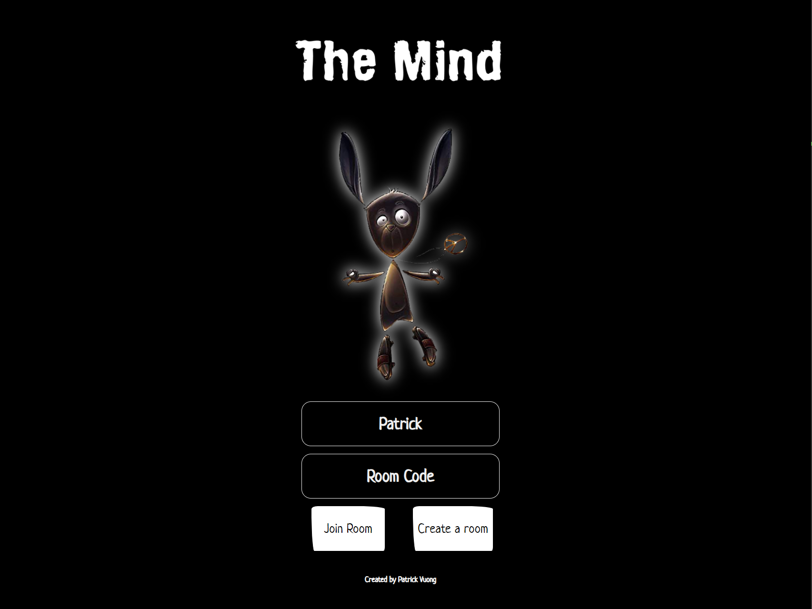
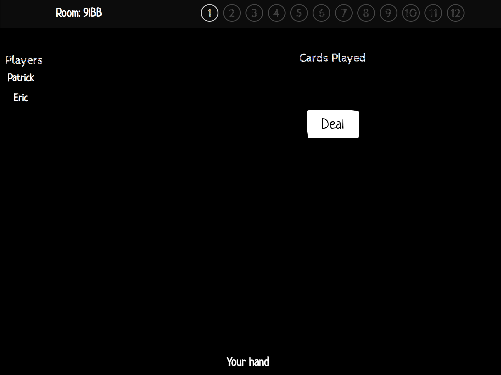
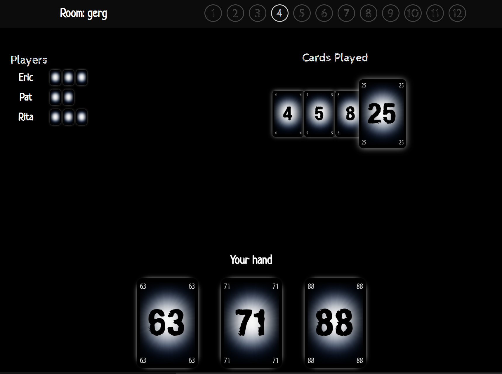
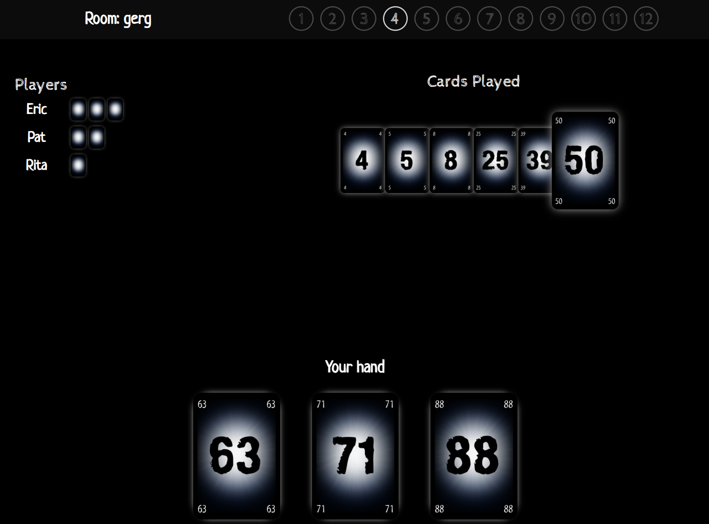
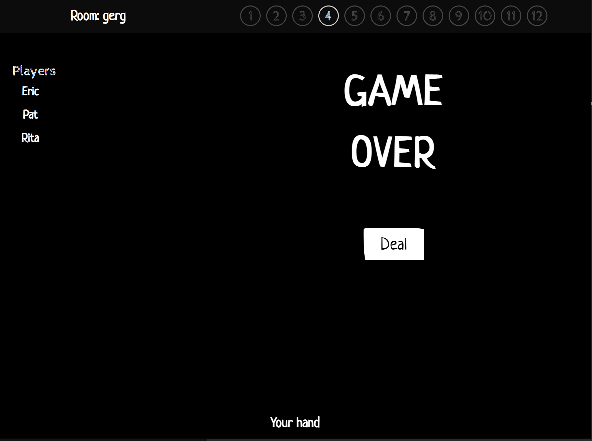
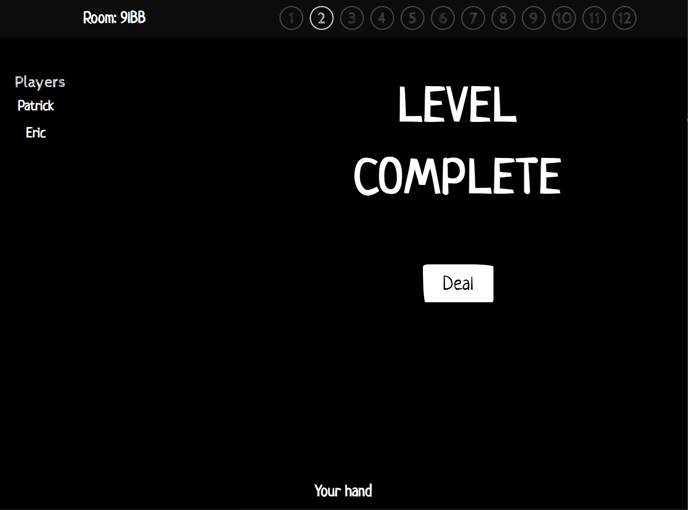

<h1> The Mind Card Game </h1>

The Mind Card Game using React, Express and Socketio

[DEMO Hosted on AWS EC2](http://3.85.232.21)

<h2>Setup</h2>

Simply download and execute 'npm run dev' in the terminal after installing dependencies

Please see <a href='https://www.ultraboardgames.com/the-mind/game-rules.php'>here</a> for the rules to the game

<h3>Create a game</h3>

Create a game by inserting your name and clicking the "Create Game" button. (No need to enter a room code). A room code will be generated and will display in the top-left corner of the game. Pass this room code out to your friends in order for them to join the game

<h3>Join a game</h3>

To join a game simply insert a name and input the room code.

At ANY point anyone may join the game, but will have to wait until the round is over before cards will be dealt to them. 

Those joining a game in session will be able to continue from the level of those in the room. 

<h3>Session</h3>

Once in the session you may deal out the cards. Unique cards ranging from 1-100 will be randomly dealt out to all players.

To play a card simply click on it. The left side shows the players in the session, as well as the remaining cards in each persons hand. The right side will show the cards that have been played. The largest card will be the most recently played card.

Above image shows another players perspective

If the cards are not played in ascending order in accordance with all cards dealt, a "Game Over" message will show on screen. If this occurs then the level will not increment, and you will play the same level again until it is complete.

If all cards have been played correctly in ascending order, the "Level Complete" message will show and the level will be incremented by 1. The next round will continue and an additional card will be dealt in the following round.

<h2>Functions to add</h2>
<ul>
<li>WebRTC video/audio chat</li></ul>
